# Software Testing and Validation

*André dos Santos Martins Ribeiro* - **104083**
*Lourenço Mourão* - **102122**
*Serhii Ivanenko* - **102058**

**Date:** May 2022


## Motivation

Design and implement a test suite given the project specification. The specification models a portal of restaurants that allows clients to buy meals from existing restaurants. 


## Objective

Design and Develop test cases applying the most appropriate test pattern for each case. The test cases to design are the following:

- **Restaurant** and **ShoppingTray** at the class scope
- **computeDiscount()** of class Rest and **add()** of class Restaurant at method scope
- Implement eight test cases concerning the test suite that tests the class **Restaurant**


## Table of Contents

1. [Method Scope Test Suite](#Method Scope Test Suite)
   1. [computeDiscount()](##computeDiscount())
   2. [add()](##add())
2. [Class Scope Test Suite](#Class Scope Test Suite)
   1. [Restaurant](##Restaurant)
   2. [ShoppingTray](##ShoppingTray)

3. [Implementation of Restaurant Class Test Suite](#Implementation of Restaurant Class Test Suite)


## Method Scope Test Suite

Using Method Scope Test Design Pattern we have designed test suites for the methods *computeDiscount()* and *add()* structured in such a way as that it describes which test pattern was chosen, the results of the different stages of the test pattern and a final description of the resulting test cases.


### computeDiscount()

**Used Test Pattern:** Combinational Functional Test


We started with drawing a decision tree that represents all the possible variants of this method. This allows us to identify the different variants that will be used for the next step.

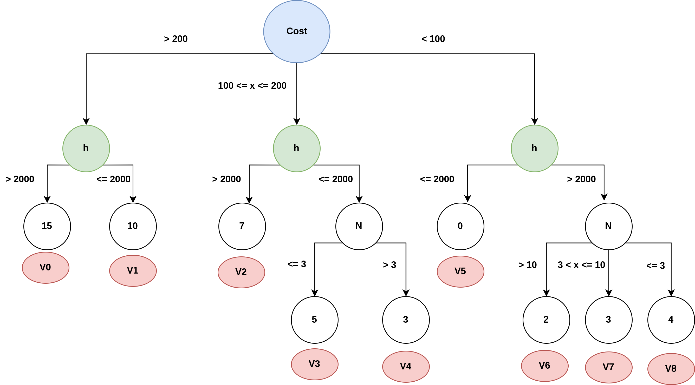


After which, we created a decision table representing the inputs and expected outputs of each variant.

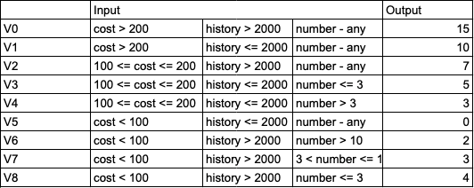


And defined the domain matrix for each variant representing each boundary points and expected results and if they were accepted or not (in green).

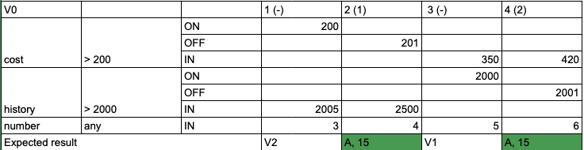

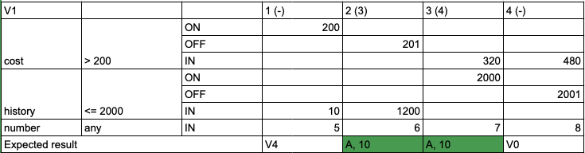

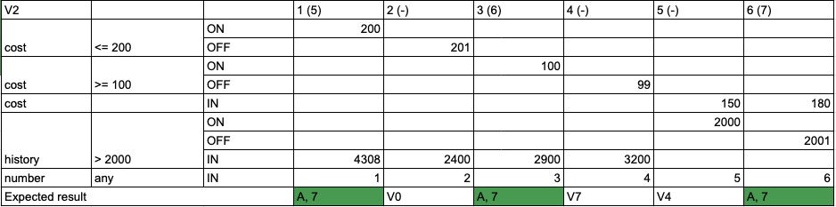

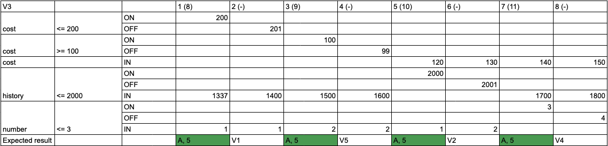

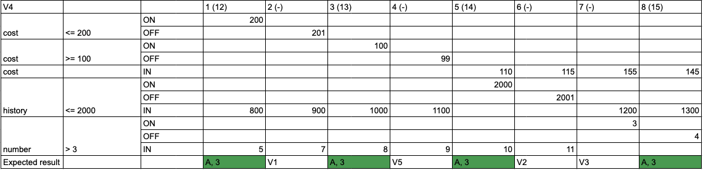

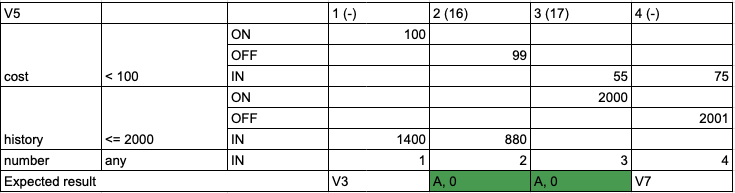

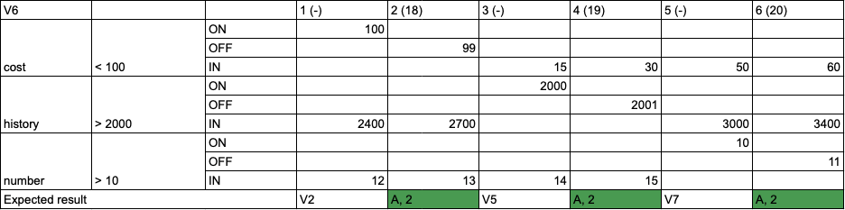

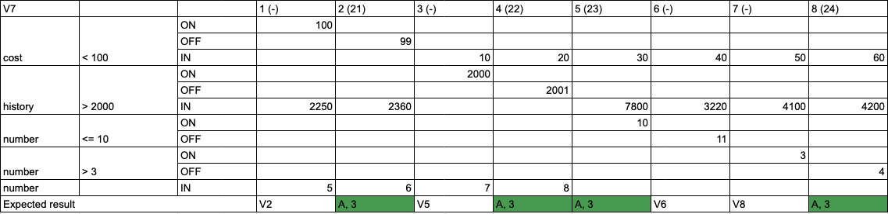

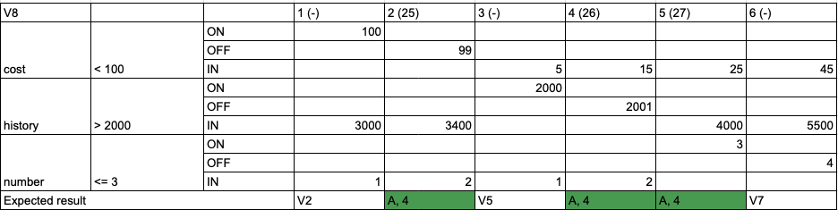


We have a total of **27 accepted tests** that don't overlap with other variants.


### add()

**Used Test Pattern:** Category Partition Test


We started by creating a list of the functions of that method:

- Add Dish
- Check if Restaurant is full
- Check if Dish is free and we exceed amount of free dishes
- Return if dish was added
- Update price if the Dish already exists
- Check if new DIsh is free and don't add it


Then we identified the inputs and outputs.

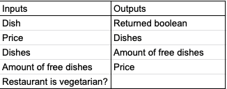


And the categories in which each of the inputs can be apart of.

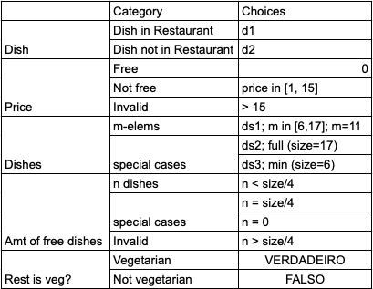


We have identified one logical constraint where:

- Dish is in Restaurant, Restaurant is vegetarian, and Dish is not vegetarian.


And designed the tests cases for each cross-join product of all the choices.

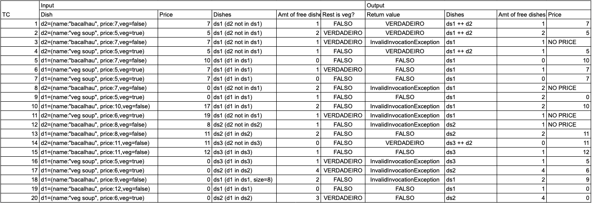


We have a total of **20 tests** from the cross-join of all the choices.


## Class Scope Test Suite

Using Class Scope Test Design Pattern we have designed test suites for the classes *Restaurant* and *ShoppingTray* structured in such a way as that it describes which test pattern was chosen, the results of the different stages of the test pattern and a final description of the resulting test cases.


### Restaurant

**Used Test Pattern:** Non-modal Class Test


We identified these conditions:

1. Vegetarian Restaurant has only vegetarian Dishes - ForEach d in VegRestaurant: d.isVeg == true
2. num of Dishes in [6,17]
3. Names of the dishes need to be unique - ForEach d1 and d2 in Restaurant: d1.name = d2.name -> d1=d2
4. Amount of free Dishes < 1/4 of number of total Dishes


And created a Domain Matrix for the class Restaurant according to the conditions and domain logic.

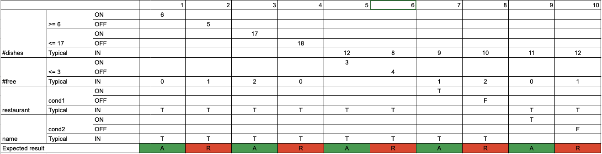


We have a total of **10 tests** in which 5 are accepted (correct behaviour) and 5 are rejected (and an exception is thrown).


### ShoppingTray


**Used Test Pattern:** Modal Class Test using a Finite State Machine Based Test Approach


We have developed a state machine diagram for the class ShoppingTray in which it represents the state of the class and its possible transitions.

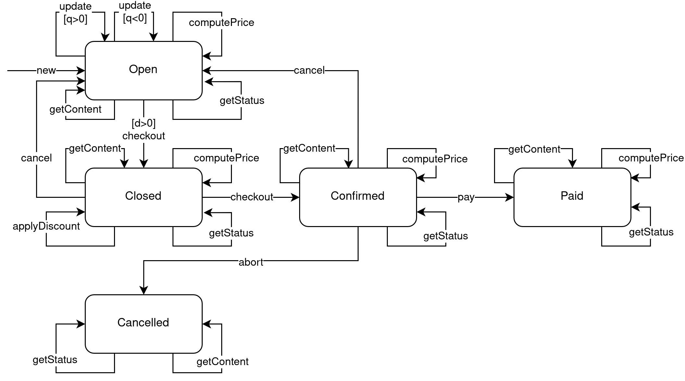


And then created a transition tree to help identify transition paths and in red the possible sneak paths that we want to get caught in a expection.

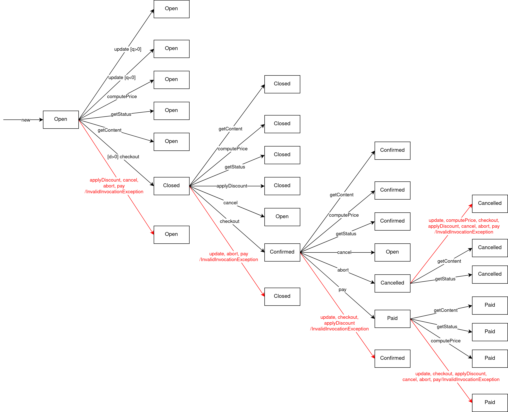


Then we identified the conditional transition variants:

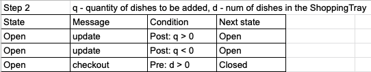


And created a Conformance Test Suite for the correct behavior paths.


Then we created test data for each path using invariant boundaries.

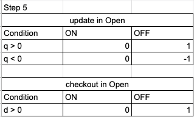


And identified the Possible Sneak Paths.

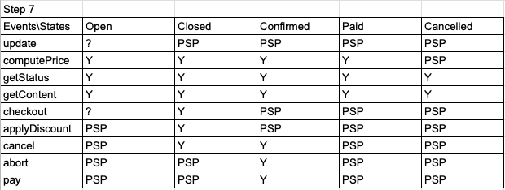


And then created a Conformance Test Suite for the PSP.

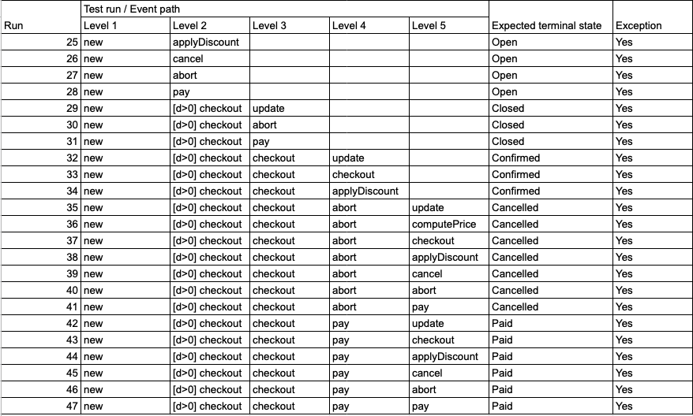


We have a total of **47 tests** including the possible sneak path tests.


## Implementation of Restaurant Class Test Suite


We have chosen to implement 8 test cases that represent the first 8 cases that we described above on the design of the [Restaurant](##Restaurant) class.

```java
package restaurant;

import org.testng.annotations.Test;
import org.testng.annotations.DataProvider;

import java.util.Arrays;
import java.util.List;

import static org.testng.Assert.*;

@Test
public class TestRestaurant {

    @DataProvider
    private Object[][] computeValidDataForRestaurant() {
        Dish dish1 = new Dish("abc", "ok", false, 7);
        Dish dish2 = new Dish("bcde", "ko", false, 9);
        Dish dish3 = new Dish("cdefg", "fds", true, 10);
        Dish dish4 = new Dish("ab", "aaaaa", false, 11);
        Dish dish5 = new Dish("jkrig", "m", false, 14);
        Dish dish6 = new Dish("ytong", "odfdgk", false, 4);
        Dish dish7 = new Dish("hokr", "oklkds", true, 6);
        Dish dish8 = new Dish("reren", "okooa", true, 2);
        Dish dish9 = new Dish("salo", "kokos", false, 7);
        Dish dish10 = new Dish("ppfd", "gdfcxx", true, 8);
        Dish dish11 = new Dish("vnmde", "das-fd", false, 0);
        Dish dish12 = new Dish("iddo", "fdscv", false, 13);
        Dish dish13 = new Dish("kllmm", "dfg", false, 11);
        Dish dish14 = new Dish("odas", "dsf ds", true, 8);
        Dish dish15 = new Dish("mmn", "fhgvhs", false, 7);
        Dish dish16 = new Dish("hgfo", "sawdqs", false, 4);
        Dish dish17 = new Dish("hog", "fdsf", true, 0);
        Dish dish18 = new Dish("ncs", "mmnvd", false, 7);
        Dish dish19 = new Dish("test", "ekekks", true, 6);
        Dish dish20 = new Dish("vwwdg", "ekek21", true, 6);
        Dish dish21 = new Dish("yred", "ekek14", true, 4);
        Dish dish22 = new Dish("olfh", "ekek745", true, 3);
        Dish dish23 = new Dish("mnbd", "ekes3", true, 6);
        Dish dish24 = new Dish("qwsdq", "eke24ks", true, 5);
        Dish dish25 = new Dish("zzxc", "eke3kks", true, 9);
        Dish dish26 = new Dish("zztop", "e79kekks", true, 8);
        Dish dish27 = new Dish("dmode", "eke32kks", true, 11);
        Dish dish28 = new Dish("oelzy", "ek0e2kks", true, 13);
        Dish dish29 = new Dish("vwvw", "ek3e9kks", true, 14);
        Dish dish30 = new Dish("acdc", "ek3ek5ks", true, 0);
        Dish dish31 = new Dish("metal", "ek3ek5ks", true, 0);
        return new Object[][] {
                {"Claude Monet", "Str. Shukhevycha", Arrays.asList(dish1, dish2, dish9, dish10, dish14, dish19), false},
                {"VegChum", "Av. de Berna", Arrays.asList(dish3, dish7, dish8, dish10, dish14, dish17, dish20, dish21, dish22, dish23, dish24, dish25, dish26, dish27, dish28, dish29, dish30), true},
                {"GoVeg", "Iifds", Arrays.asList(dish3, dish7, dish8, dish10, dish14, dish17, dish22, dish24, dish31, dish28, dish30, dish25), true},
                {"Lisbon", "Tehran", Arrays.asList(dish4, dish5, dish6, dish11, dish12, dish13, dish15, dish16, dish18), false},
        };
    }

    @Test(dataProvider = "computeValidDataForRestaurant")
    public void testRestaurantAccepted(String name, String address, List<Dish> dishes, boolean isVegetarian) {
        // Arrange
        Restaurant rest = new Restaurant(name, address, dishes);
        // Act
        rest.setVegetarian(isVegetarian);
        // Assert
        assertEquals(rest.getName(), name);
        assertEquals(rest.getAddress(), address);
        assertEquals(rest.getDishes(), dishes);
        assertEquals(rest.isVegetarian(), isVegetarian);
    }

    @Test
    public void testRestaurantSetVegetarian() {
        // Arrange
        String name = "Bong";
        String address = "Unter den Linden";
        Dish dish1 = new Dish("abc", "ok", true, 7);
        Dish dish2 = new Dish("bcde", "ko", true, 9);
        Dish dish3 = new Dish("cdefg", "fds", true, 10);
        Dish dish4 = new Dish("ab", "aaaaa", false, 11);
        Dish dish5 = new Dish("jkrig", "m", true, 14);
        Dish dish6 = new Dish("ytong", "odfdgk", true, 0);
        Dish dish7 = new Dish("hokr", "oklkds", true, 6);
        Dish dish8 = new Dish("reren", "okooa", true, 0);
        Dish dish9 = new Dish("salo", "kokos", false, 7);
        Dish dish10 = new Dish("ppfd", "gdfcxx", true, 8);
        List<Dish> dishes = Arrays.asList(dish1, dish2, dish3, dish4, dish5, dish6, dish7, dish8, dish9, dish10);
        // Act
        Restaurant rest = new Restaurant(name, address, dishes);
        assertThrows(InvalidInvocationException.class, () -> rest.setVegetarian(true));
        // Assert
        assertEquals(rest.getName(), name);
        assertFalse(rest.isVegetarian());
        assertEquals(rest.getDishes(), dishes);
        assertEquals(rest.getAddress(), address);
    }

    @Test
    public void testRestaurantAdd18Dishes() {
        // Arrange
        String name = "Aagog";
        String address = "Rua Augusta";
        Dish dish1 = new Dish("abc", "ok", true, 7);
        Dish dish2 = new Dish("bcde", "ko", true, 9);
        Dish dish3 = new Dish("cdefg", "fds", true, 10);
        Dish dish4 = new Dish("ab", "aaaaa", false, 11);
        Dish dish5 = new Dish("jkrig", "m", true, 14);
        Dish dish6 = new Dish("ytong", "odfdgk", true, 10);
        Dish dish7 = new Dish("hokr", "oklkds", true, 6);
        Dish dish8 = new Dish("reren", "okooa", true, 0);
        Dish dish9 = new Dish("salo", "kokos", false, 7);
        Dish dish10 = new Dish("ppfd", "gdfcxx", true, 8);
        Dish dish11 = new Dish("vnmde", "das-fd", false, 14);
        Dish dish12 = new Dish("iddo", "fdscv", false, 13);
        Dish dish13 = new Dish("kllmm", "dfg", false, 11);
        Dish dish14 = new Dish("odas", "dsf ds", true, 8);
        Dish dish15 = new Dish("mmn", "fhgvhs", false, 7);
        Dish dish16 = new Dish("hgfo", "sawdqs", false, 4);
        Dish dish17 = new Dish("hog", "fdsf", true, 0);
        Dish dish18 = new Dish("ncs", "mmnvd", false, 7);
        List<Dish> dishes = Arrays.asList(dish1, dish2, dish3, dish4, dish5, dish6, dish7, dish8, dish9, dish10, dish11, dish12, dish13, dish14, dish15, dish16, dish17);
        // Act
        Restaurant rest = new Restaurant(name, address, dishes);
        assertThrows(InvalidInvocationException.class, () -> rest.addDish(dish18, 14));
        // Assert
        assertEquals(rest.getDishes(), dishes);
        assertEquals(rest.getName(), name);
        assertFalse(rest.isVegetarian());
        assertEquals(rest.getAddress(), address);
    }


    @DataProvider
    private Object[][] computeInvalidDataForRestaurant() {
        Dish dish1 = new Dish("abc", "ok", false, 7);
        Dish dish2 = new Dish("bcde", "ko", false, 9);
        Dish dish3 = new Dish("cdefg", "fds", true, 10);
        Dish dish4 = new Dish("ab", "aaaaa", false, 11);
        Dish dish5 = new Dish("jkrig", "m", false, 14);
        Dish dish6 = new Dish("ytong", "odfdgk", false, 0);
        Dish dish7 = new Dish("hokr", "oklkds", true, 6);
        Dish dish8 = new Dish("reren", "okooa", true, 2);
        Dish dish9 = new Dish("salo", "kokos", false, 7);
        Dish dish10 = new Dish("ppfd", "gdfcxx", true, 8);
        Dish dish11 = new Dish("vnmde", "das-fd", false, 0);
        Dish dish12 = new Dish("iddo", "fdscv", false, 13);
        Dish dish13 = new Dish("kllmm", "dfg", false, 11);
        Dish dish14 = new Dish("odas", "dsf ds", true, 8);
        Dish dish17 = new Dish("hog", "fdsf", true, 0);
        Dish dish18 = new Dish("ncs", "mmnvd", false, 0);
        Dish dish19 = new Dish("test", "ekekks", true, 6);
        Dish dish20 = new Dish("vwwdg", "ekek21", true, 6);
        Dish dish21 = new Dish("yred", "ekek14", true, 4);
        Dish dish22 = new Dish("olfh", "ekek745", true, 3);
        Dish dish23 = new Dish("mnbd", "ekes3", true, 6);
        Dish dish24 = new Dish("qwsdq", "eke24ks", true, 5);
        Dish dish25 = new Dish("zzxc", "eke3kks", true, 9);
        Dish dish26 = new Dish("zztop", "e79kekks", true, 8);
        Dish dish27 = new Dish("dmode", "eke32kks", true, 11);
        Dish dish28 = new Dish("oelzy", "ek0e2kks", true, 13);
        Dish dish29 = new Dish("vwvw", "ek3e9kks", true, 14);
        Dish dish30 = new Dish("acdc", "ek3ek5ks", true, 15);
        Dish dish31 = new Dish("metal", "ek3ek5ks", true, 1);
        return new Object[][] {
                {"Musow", "Str. Levytskoho", Arrays.asList(dish2, dish1, dish9, dish13, dish17), false},
                {"VegKeg", "Ahahaha", Arrays.asList(dish3, dish7, dish8, dish10, dish14, dish19, dish20, dish21, dish22, dish23, dish24, dish25, dish26, dish27, dish28, dish29, dish30, dish31), true},
                {"Toronto", "Av. de Libedrade", Arrays.asList(dish4, dish5, dish17, dish11, dish12, dish13, dish18, dish6), false},
        };
    }

    @Test(dataProvider = "computeInvalidDataForRestaurant")
    public void testRestaurantRejected(String name, String address, List<Dish> dishes, boolean isVegetarian) {
        // Assert
        assertThrows(InvalidInvocationException.class, () -> new Restaurant(name, address, dishes));
    }
}
```

